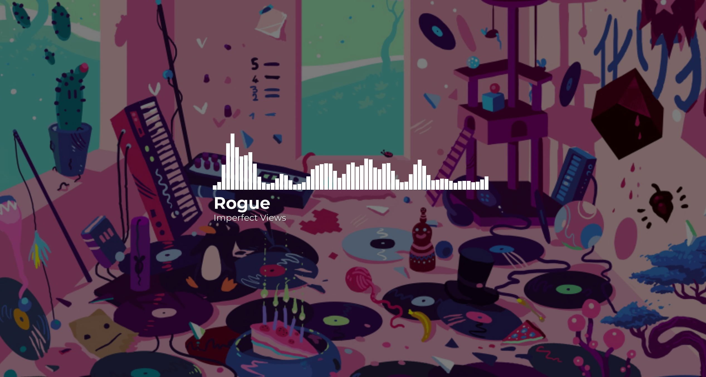

# Monstercat Spectrum
Music player made in Unity based on Monstercat's audio spectrum.

Disclaimer: Work in progress, there's still a lot of things to do; Windows only.

## Features

Supported file types: .mp3
- Drag&drop system
- Autoplay next track in directory
- Default music app support
- Cover art support - changes background depending on album covers from file

## Libraries used

- Bass .NET
- TagLib .NET
- Drag&Drop script by @Bunny83 (https://github.com/Bunny83/UnityWindowsFileDrag-Drop)

## How to use it
Just drag&drop music file into window to start playing (In future we will add ability to browse files through application).

## Unity version: 2020.1.1f1